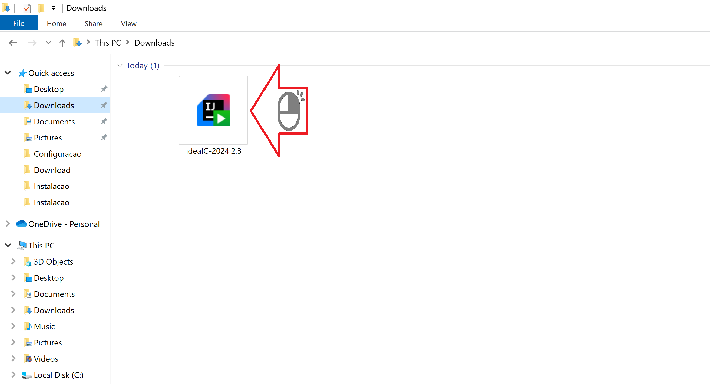
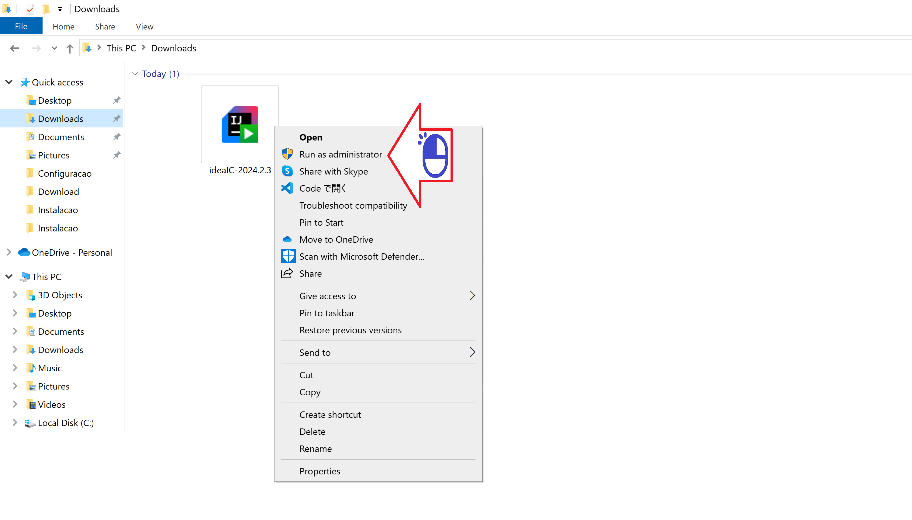
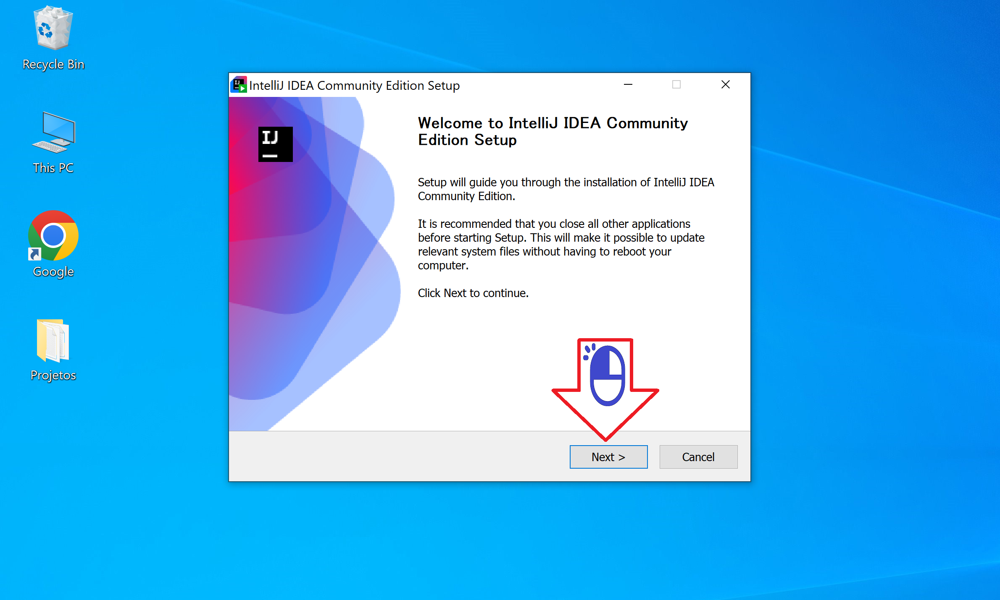
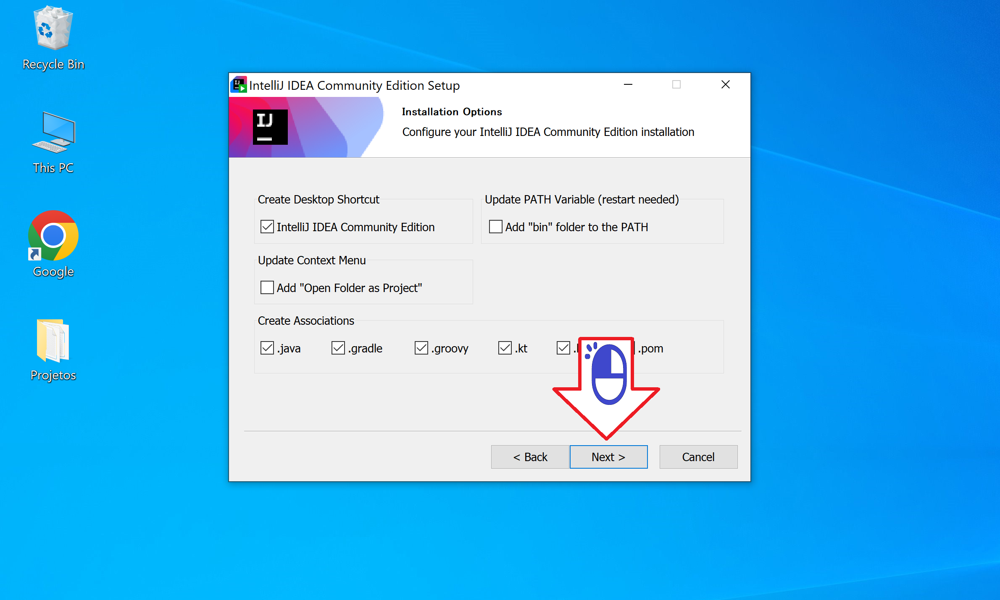
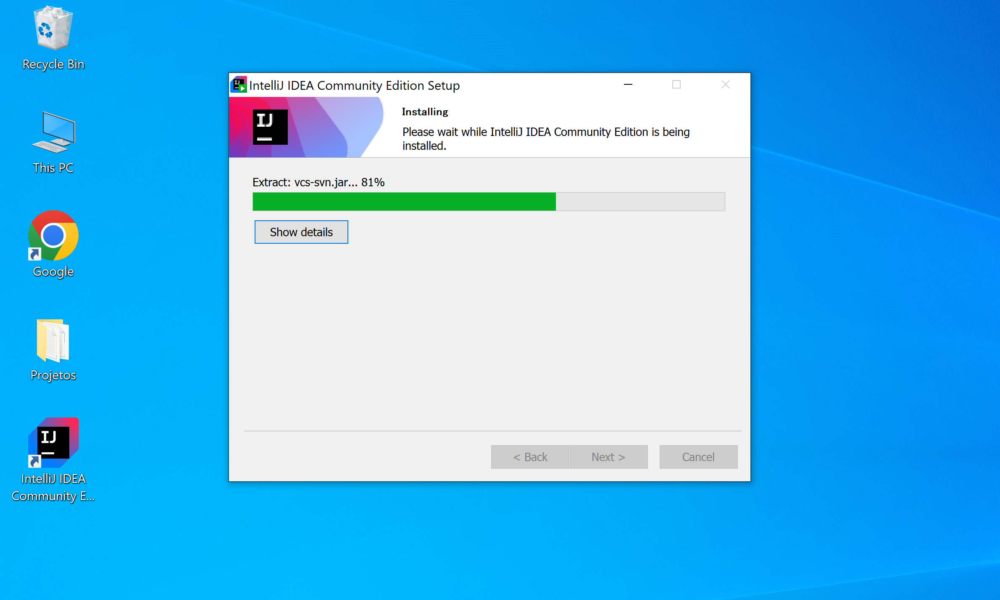

# Configuração do Android Studio

Configurando o Android Studio no Windows

Figura 01 - Clique OK

Figura 02 - Sua escolha

Figura 03 - Clique Next

Figura 04 - Clique Next

Figura 05 - Clique Next

Figura 06 - Clique Next

Figura 07 - Clique Finish

Figura 08 - Clique Finish

Figura 09 - Baixando componentes

Figura 10 - Clique Finish

