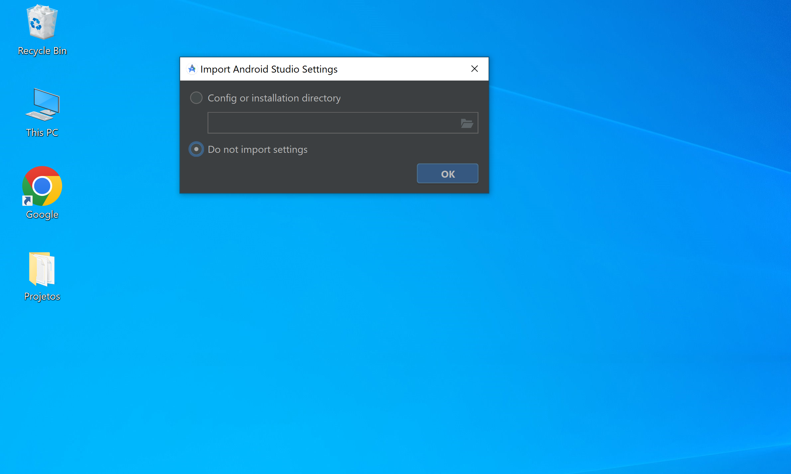
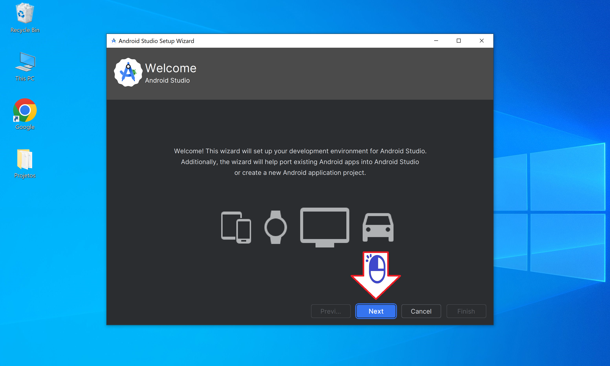
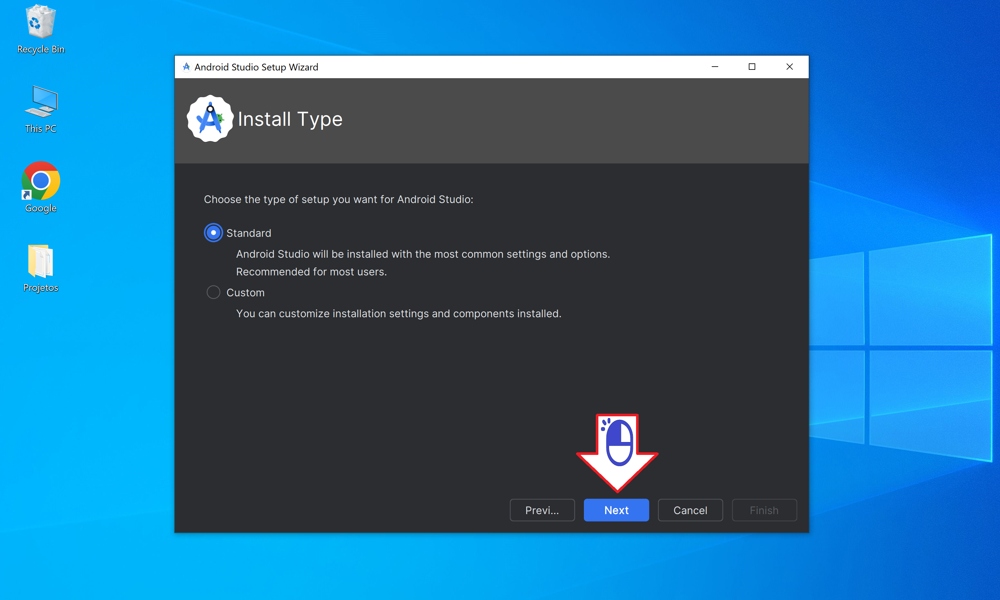
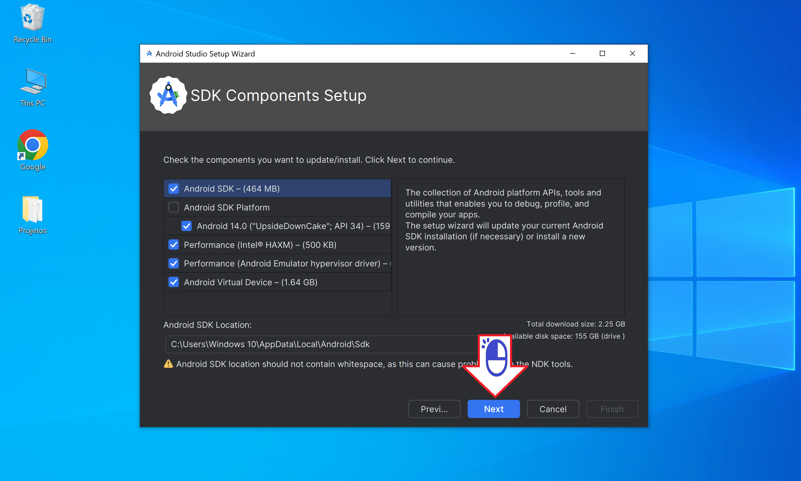
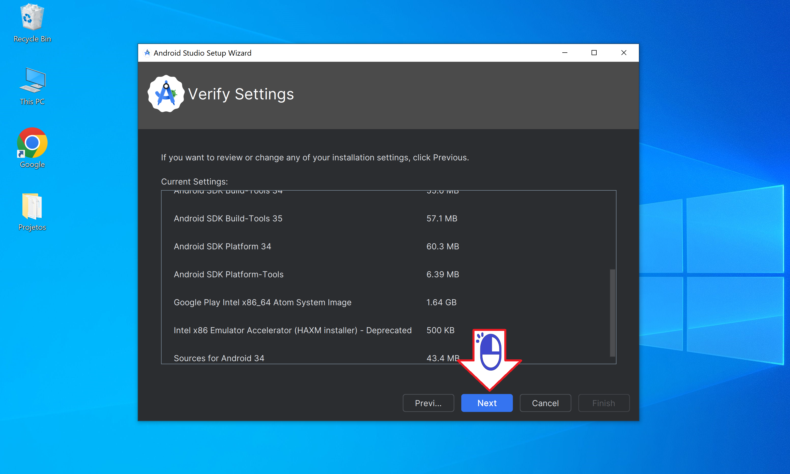
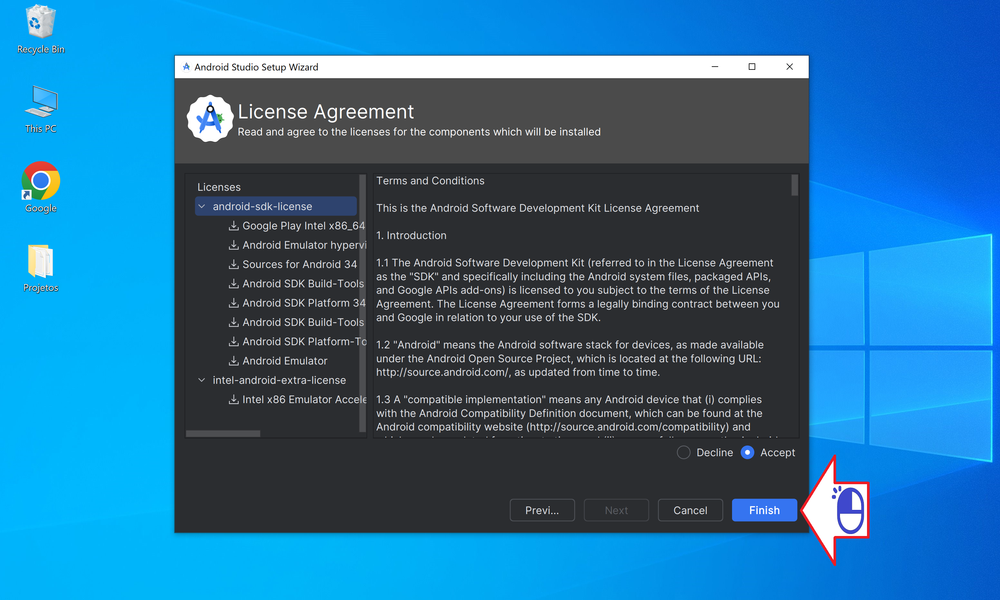
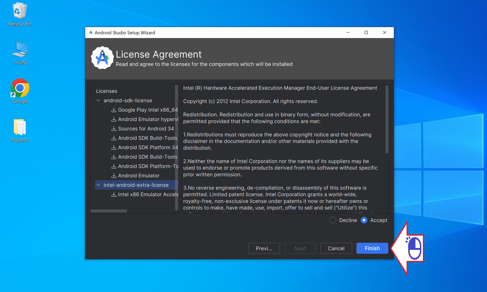
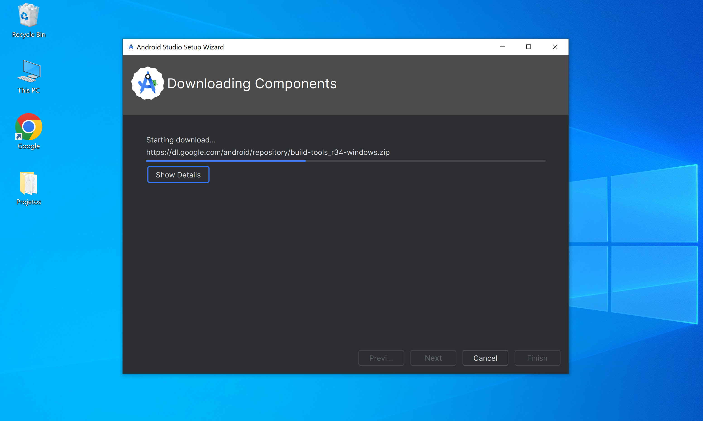
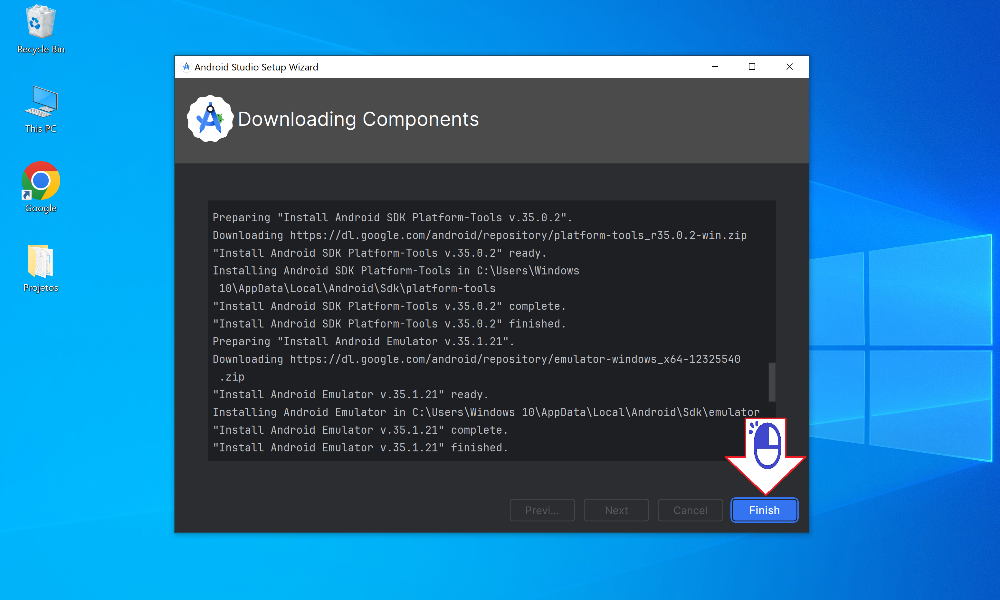

# アンドロイドスタジオの設定

ウィンドウズでのアンドロイドスタジオの構成

絵 01 - 「OK」をクリックします

絵 02 - あなたの好み

絵 03 - 「次へ」をクリックします

絵 04 - 「次へ」をクリックします

絵 05 - 「次へ」をクリックします

絵 06 - 「次へ」をクリックします

絵 07 - 「完了」をクリックします

絵 08 - 「完了」をクリックします

絵 09 - コンポーネントのダウンロード

絵 10 - 「完了」をクリックします

