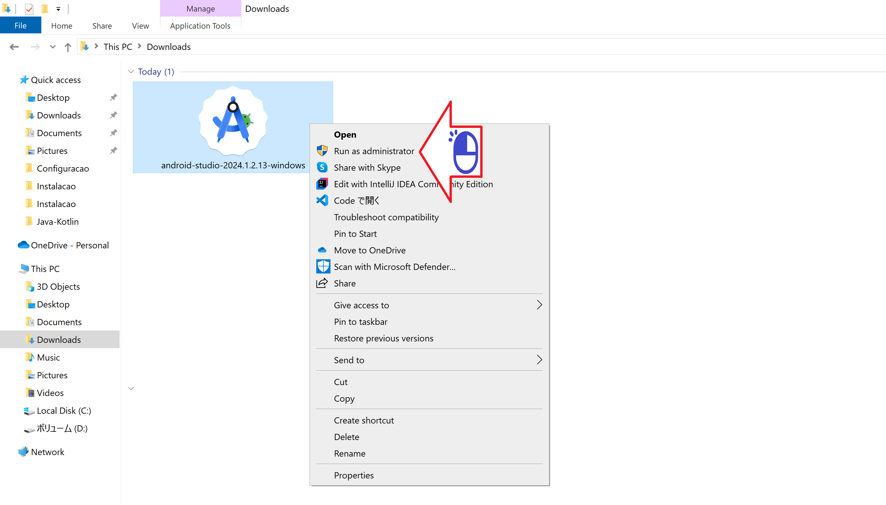
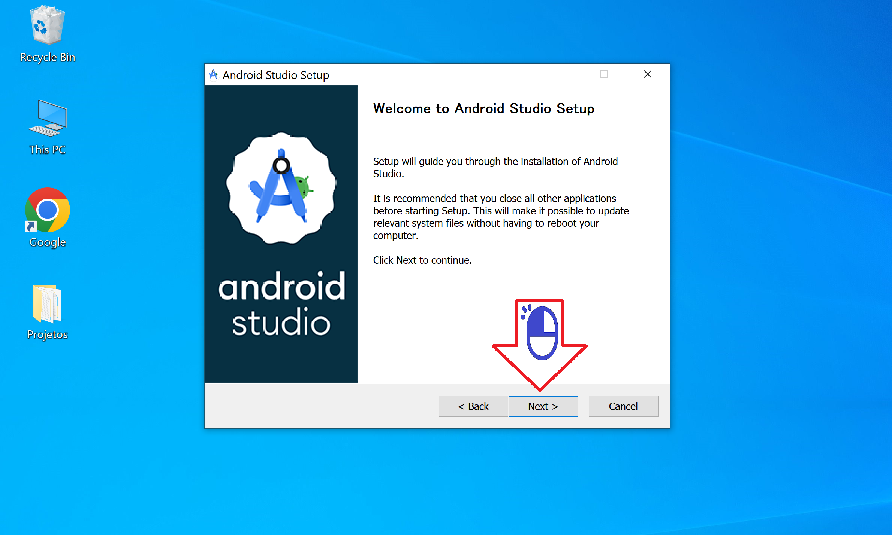
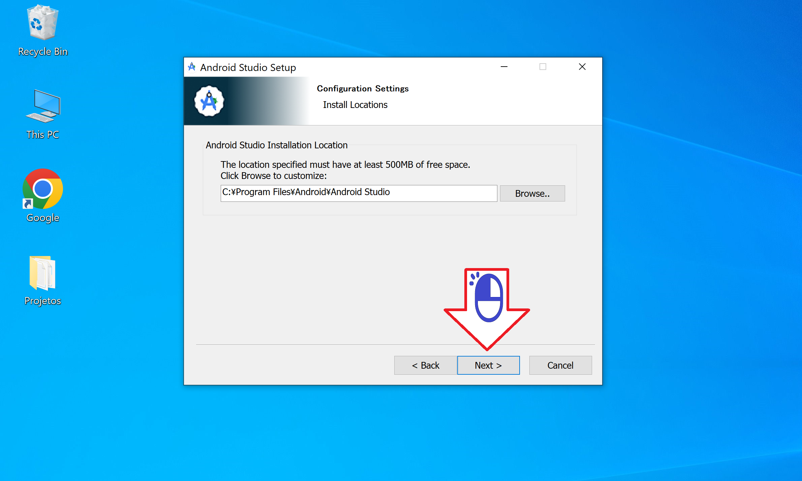
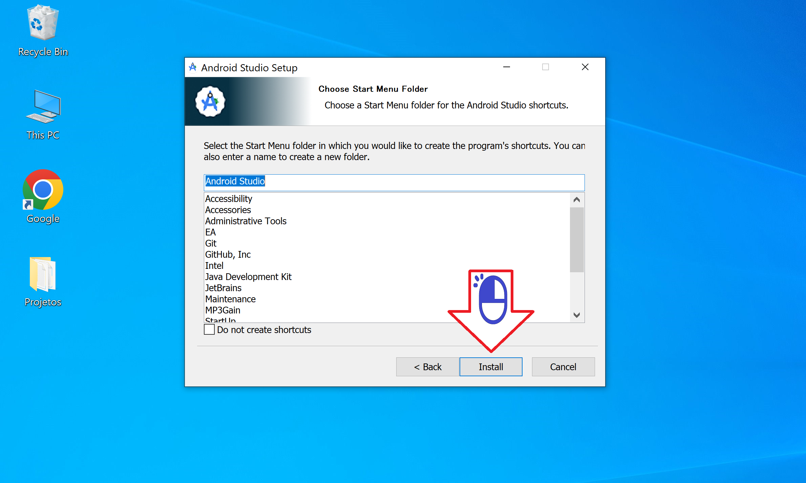
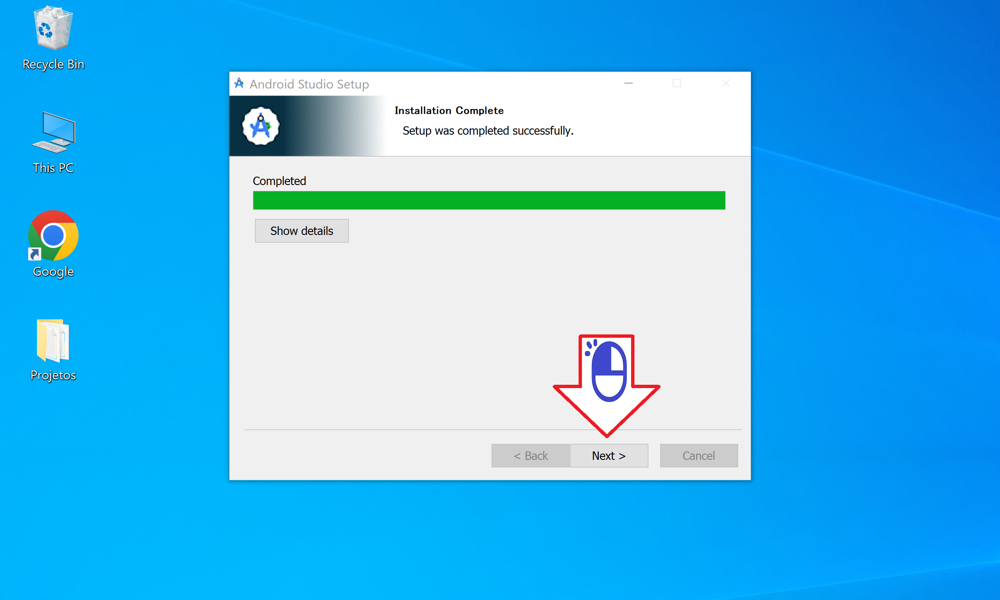
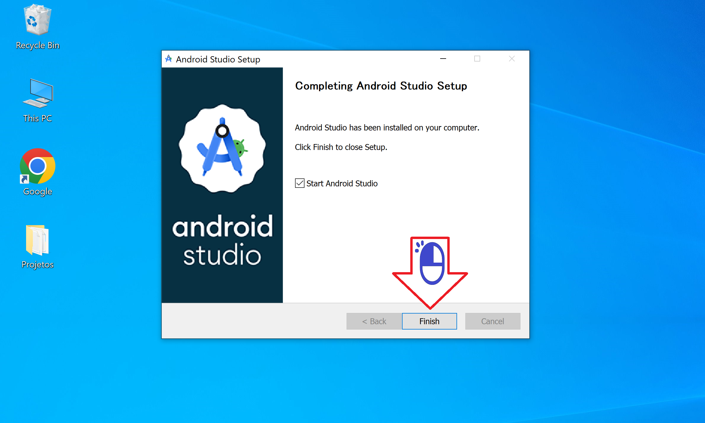

# Instalação do Android Studio

Instalando o Android Studio no Windows

Figura 01 - Clique com o botão direito

Figura 02 - Clique em Run as Administrator

Figura 03 - Clique next

Figura 04 - Clique next

Figura 05 - Clique next

Figura 06 - Clique Install

Figura 07 - Clique next

Figura 08 - Clique Finish

