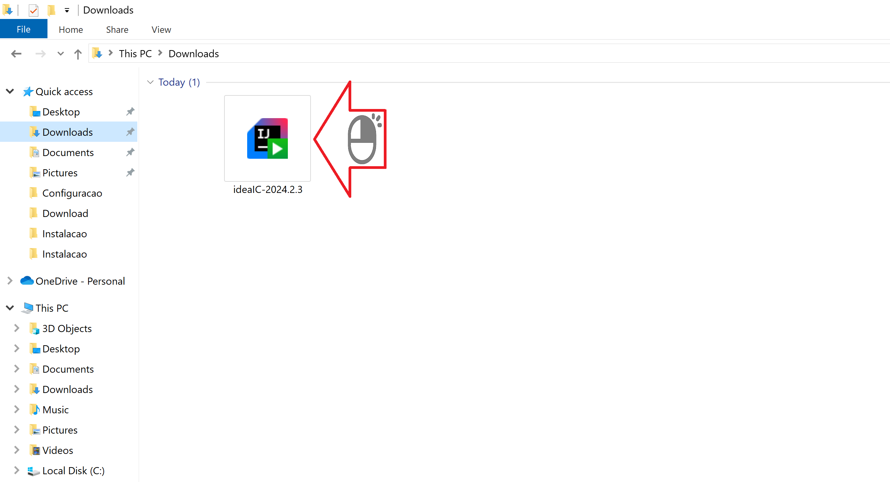
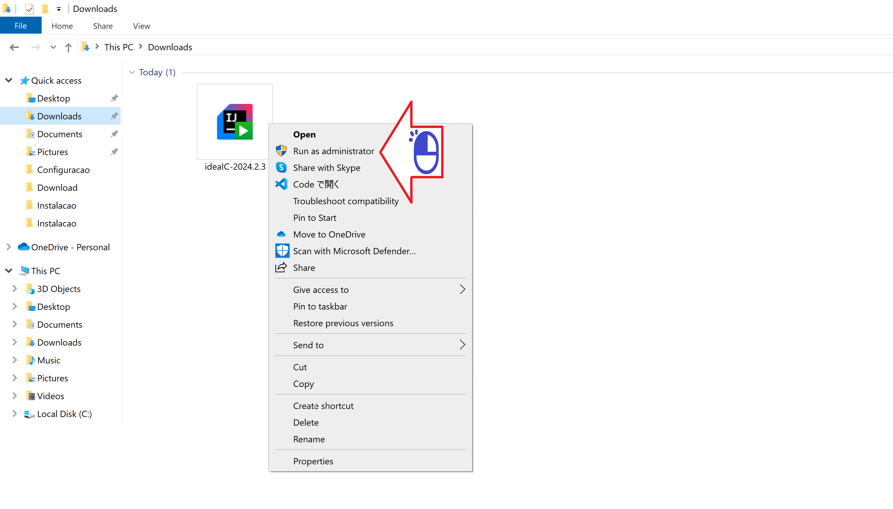
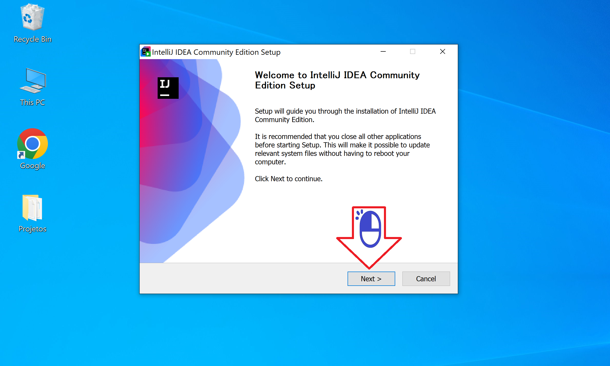
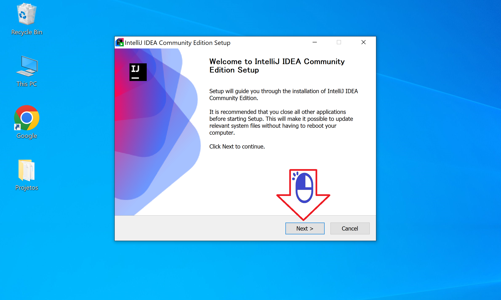
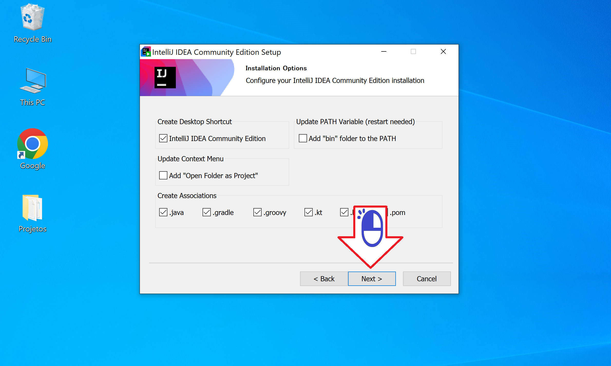
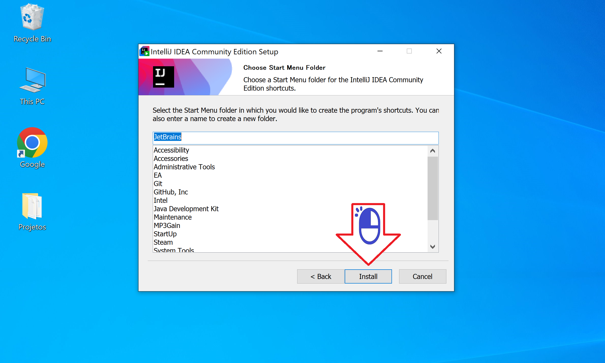
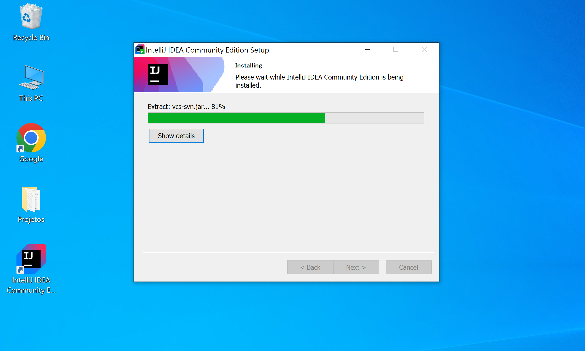
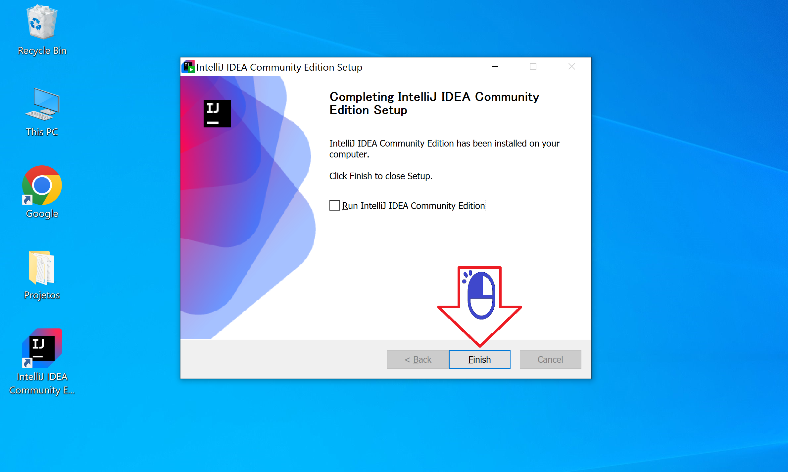

# Android Studioのインストール

ウィンドウズでのAndroid Studioのダウンロード

絵 01 - 右クリックします

絵 02 - 「Run as Administrator」をクリックします

絵 03 - 「次へ」をクリックします

絵 04 - 「次へ」をクリックします

絵 05 - 「次へ」をクリックします

絵 06 - 「インストール」をクリックします

絵 07 - 「次へ」をクリックします

絵 08 - 「Finish」をクリックします

