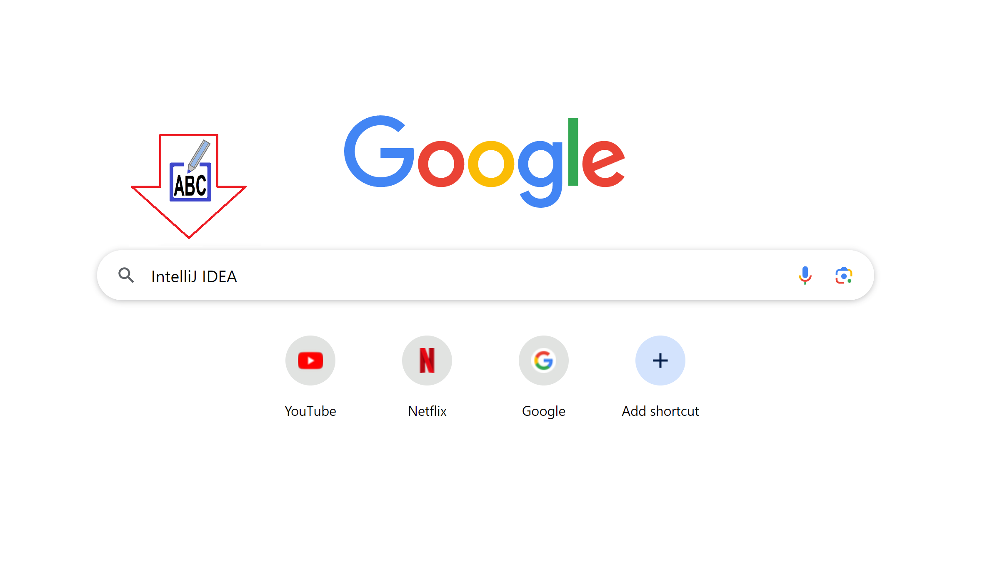
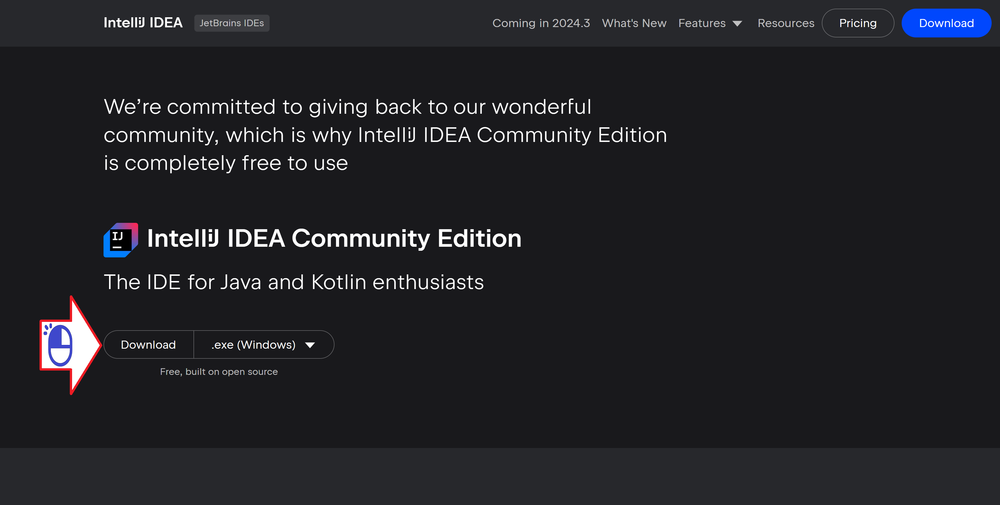

# Download IntelliJ

Baixando o IntelliJ IDEA no Windows

Figura 01 - Buscando o Site do IntelliJ no Google

Figura 02 - JetBrains empresa que desenvolveu o IntelliJ

Figura 03 - Procurando o link do download

Figura 04 - IntelliJ IDEA Community Edition

Figura 05 - IntelliJ para o Windows

