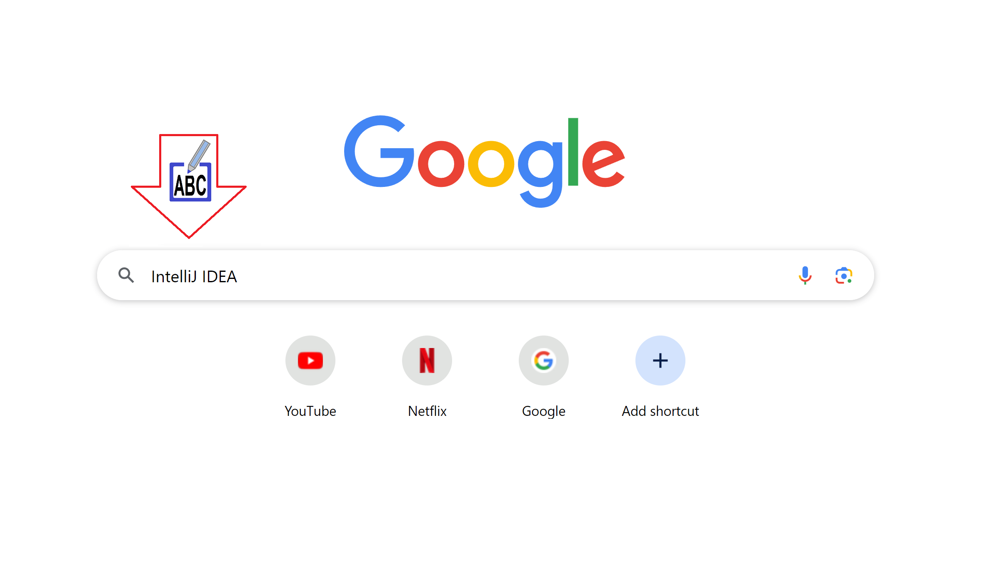
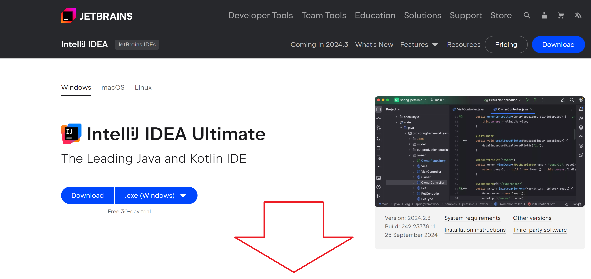
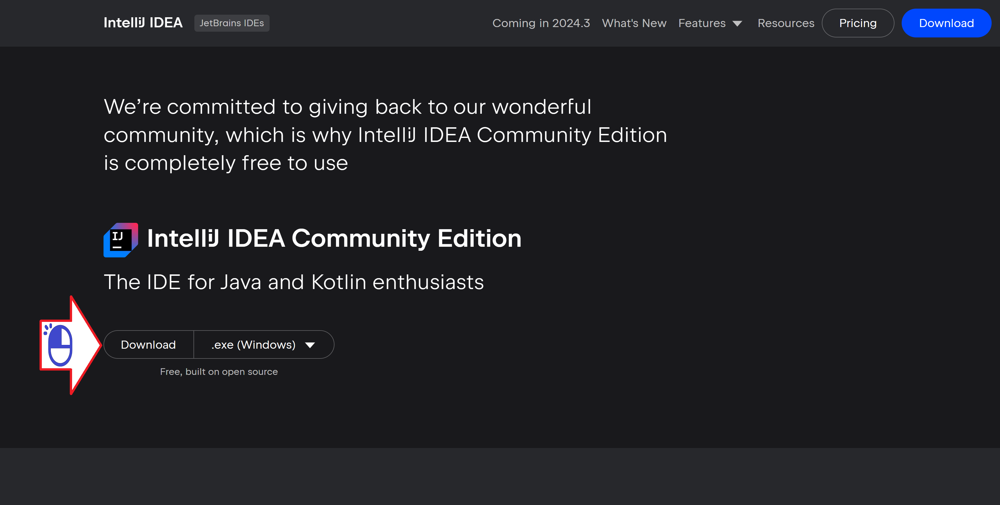

# IntelliJのダウンロード

ウィンドウズでのIntelliJアイディーイーのダウンロード

絵 01 - GoogleでIntelliJ Siteサイトを検索する

絵 02 - IntelliJを管理するJetBrains社

絵 03 - ダウンロードリンクを探しています

絵 04 - IntelliJ IDEA Community Edition

絵 05 - ウィンドウズ用IntelliJ

