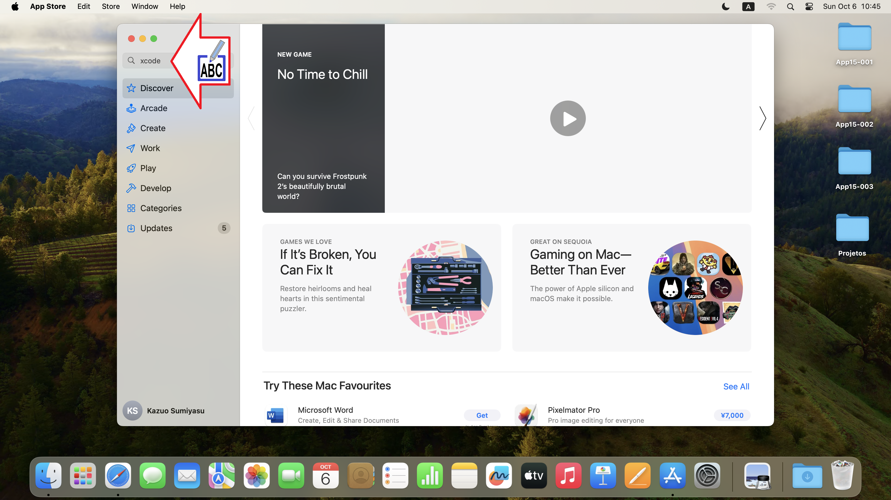

# マックへのエックスコードのインストール
アイオーエスアプリ開発用のアップルの公式IDE

Figura 01 - スポットライト検索にアクセスする

Figura 02 - アプリストアに入る

Figura 03 - エックスコードを入力してください

Figura 04 - 雲をクリックします

Figura 05 - アプリケーションのダウンロード

Figura 06 - 「開く」をクリックします

Figura 07 - 「同意する」をクリックします

Figura 08 - あなたのパスワード

Figura 09 - 「ダウンロードしてインストール」をクリックします

Figura 10 - エックスコードのインストール

Figura 11 - 「エックスコードを再起動」をクリックします

Figura 12 - アイオーエスシミュレータのインストール

Figura 13 - 完了しました

